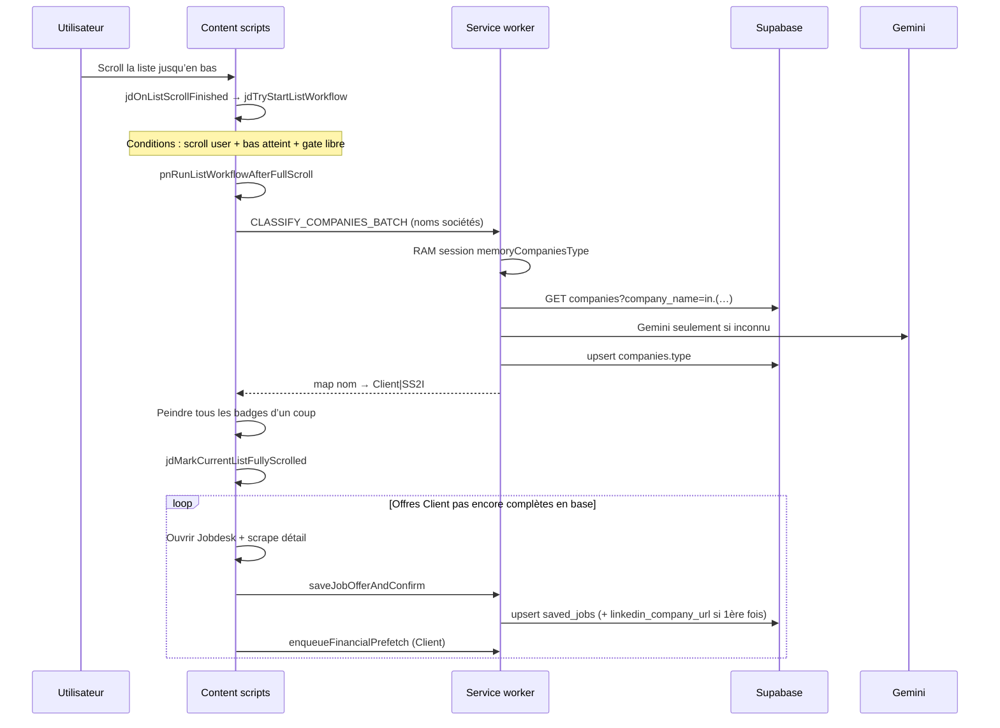

# Prospection — fonctionnement de l’extension

> **À coller / lier au début d’un nouveau chat Cursor** pour redonner le contexte sans tout réexpliquer.
>
> Dossier : `extension-prospection/` · Manifest V3 · version actuelle : voir `manifest.json`  
> Repo GitHub typique : `nmakedonsky/extension-prospection`  
> Ne pas confondre avec `archive-extension-prospection` (ancien « LinkedIn Prospection Helper » 1.0.0).

---

## 1. Objectif

Extension Chrome qui tourne sur **LinkedIn** pour :

1. **Classer** chaque employeur Jobs en **SS2I** / **Client**.
2. **Afficher des badges** dans la liste d’offres.
3. **Ouvrir automatiquement** les offres **Client + SS2I** pour scraper le Jobdesk → Supabase (marché freelance).
4. **Afficher un dock financier** (Gemini + caches ; prefetch auto surtout Client), HubSpot / SendPilot en option.
5. **Aspirer les profils** visités (`/in/…`) → upsert `saved_prospects` (même colonnes que l’import Waalaxy + `linkedin_profile_json`).

Contrainte transversale : **minimiser les requêtes** (batch, caches RAM / Chrome / Supabase, buffers par onglet).

---

## 2. Pages LinkedIn ciblées

Content scripts Jobs/financial sur `https://*.linkedin.com/*` (`document_idle`). Scripts profil séparés sur `/in/*` (hook MAIN `document_start` + parse isolé).

Pages où la classification / le workflow liste s’activent (`isClassificationTargetPage` dans `content/jobs/scan.js`) :

| Type | URLs typiques |
|------|----------------|
| Search-results | `/jobs/search-results`, `/jobs/search/` |
| Slug listing | `/jobs/*-emplois/` |
| Collections | `/jobs/collections` |

Classes HTML marqueurs : `pn-path-jobs-search-results` / `pn-path-jobs-collections`.

L’extension distingue **colonne liste** vs **panneau détail** (`geometry-path.js` : `isInLeftJobListColumn`, `isNodeInJobDetailsComposed`) pour ne pas poser de badges sur le détail.

---

## 3. Architecture technique

```
┌─────────────────────────────────────────────────────────────┐
│  LinkedIn Jobs (page)                                       │
│  content scripts (ordre dans manifest.json)                 │
│    jobs/* → financial/* → scrape/autoopen → dock → prefetch │
└───────────────────────┬─────────────────────────────────────┘
                        │ chrome.runtime.sendMessage
┌───────────────────────▼─────────────────────────────────────┐
│  Service worker : background.js + importScripts             │
│  classify, financial pipeline, Supabase jobs/companies,     │
│  file de prefetch, buffers d’onglet                         │
└───────────────────────┬─────────────────────────────────────┘
                        │
        ┌───────────────┼───────────────┐
        ▼               ▼               ▼
   Supabase         Gemini API      HubSpot (opt.)
   companies /      classify +
   saved_jobs /     financial
   extension_logs
```

### Fichiers clés

| Rôle | Fichiers |
|------|----------|
| Gate scroll / soft `start=` / auto-open / pastille statut | `content/jobs/jobdesk-autoopen.js` |
| Workflow post-scroll (classify → auto-open) | `content/jobs/list-workflow.js` |
| Badges + batch classify | `content/jobs/badges-classify.js` |
| Tick DOM / catch-up | `content/jobs/jobs-run.js` |
| Collecte cartes | `content/jobs/collect-cards.js` |
| Scrape Jobdesk | `content/jobs/jobdesk-scrape.js` |
| Prefetch financier après scrape Client | `content/jobs/prefetch-client-financial.js` |
| Dock financier UI | `content/financial/*` |
| Contexte match (URL LinkedIn société, logo…) | `content/company-match-context.js` |
| Classify batch SW | `background.js` (`classifyCompaniesBatch`) |
| Jobs Supabase | `sw-supabase-jobs.js` |
| Profils `/in/` → `saved_prospects` | `content/profiles/*`, `sw-supabase-prospects.js` (`UPSERT_LINKEDIN_PROSPECT`) |
| Financial + cache Chrome | `sw-financial.js`, `sw-supabase-financial.js`, `sw-financial-prefetch-queue.js` |
| URL société figée | `sw-company-linkedin-url.js` |
| Moins de requêtes (buffer logs/jobs/last_seen) | `sw-tab-flush-buffers.js` |
| Schéma SQL | `supabase-schema.sql` |
| Secrets locaux (gitignored) | `local-config.js` ← depuis `local-config.example.js` |
| Config UI | `popup.html` / `popup.js` |

---

## 4. Flux principal (liste → badges → scrape → finance)



### Étapes en clair

1. L’utilisateur ouvre une liste Jobs (search / collections / `*-emplois`).
2. Les scripts observent le DOM (`MutationObserver` + `tick` dans `jobs-run.js`) et envoient des heartbeats.
3. L’utilisateur **scrolle la colonne liste jusqu’en bas**.
4. `jdTryStartListWorkflow` : classify → **gate badges** (0 manquant classifiable) → sinon abort « Labels incomplets » → puis auto-open.
5. Pastille statut ; scrape un par un avec re-peinture / re-classify entre clics si LinkedIn change `start=`.
6. Pour chaque Client incomplet en Supabase : ouverture Jobdesk → scrape → `saved_jobs` → prefetch financier.
7. Au départ de la liste / `pagehide` : flush des buffers (IDs vus, `last_seen_at`, logs).

---

## 5. Gate « fin de scroll » (critique)

Intention codée : **ne pas classer / peindre trop tôt** pendant que LinkedIn virtualise et charge encore des cartes.

Implémentation (`jobdesk-autoopen.js`) :

| Concept | Détail |
|---------|--------|
| Racine scroll | `jdGetLikelyJobsListScrollRoot` (liste résultats / scaffold) |
| Scroll utilisateur | `JD_LIST_USER_SCROLLED_KEYS` via `jdNoteListScrollActivity` |
| Bas atteint | `scrollHeight - (scrollTop + clientHeight) ≤ ~28px` |
| Page « done » | `JD_FULLY_SCROLLED_LIST_KEYS` — clé **avec** `start=` (`jdListPageKey`) |
| Verrou pendant classify | `JD_WORKFLOW_IN_FLIGHT_KEYS` — clé **sans** `start=` (`jdListBaseKey`) |

Entrée workflow : `jdOnListScrollFinished` → `jdTryStartListWorkflow('scroll-finished')` → `pnRunListWorkflowAfterFullScroll`.

`jobs-run.js` (depuis 0.5.15) : **ne démarre plus** le workflow. Il re-peint seulement depuis le cache si le gate est déjà ouvert (virtualisation). Le classify démarre uniquement via `jdOnListScrollFinished` → `jdTryStartListWorkflow`.

Classification (`badges-classify.js`) :

- attend éventuellement la stabilisation de hauteur (`pnWaitForListScrollStable`) ;
- groupe les cartes par nom d’entreprise ;
- envoie `CLASSIFY_COMPANIES_BATCH` par chunks (taille côté CS ~10) ;
- **peint tout d’un coup** à la fin (pas de pastilles « … » dans le pass post-scroll) ;
- cache contenu `PN_COMPANY_TYPE_CACHE` pour re-peindre quand LinkedIn recycle le DOM (`pnRepaintVisibleBadgesFromCache`).

Pipeline SW (`classifyCompaniesBatch`) :

1. **RAM session** `memoryCompaniesType` (max ~800)
2. **Supabase** `GET companies` en chunks `in.(…)` (~40)
3. **Gemini** (`gemini-2.5-flash-lite`) concurrence 3 pour les inconnues → upsert `companies`

---

## 6. Soft `start=` (piège LinkedIn)

Pendant le scroll ou les clics, LinkedIn met souvent à jour le paramètre d’URL `start=` **sans** changer de recherche.

`mergeSeenClientJobsFromDom` :

- **start-only change** → ne pas traiter comme une nouvelle liste ;
- pendant la séquence auto-open (`start-soft-seq`) → clear gates page cible (pas de report scroll / fully-scrolled) + strip badges ;
- page N déjà classifiée → `start=` suivant hors auto-open → **ne pas** reporter le gate (`start-soft-newpage`) + strip ;
- avant 1er classify → garder seulement le flag « user a scrollé » (`start-soft`) ;
- **vraie** nouvelle URL de liste → flush IDs, clear gates, re-hook scroll.

Peinture badges (`pnCanPaintBadgesNow`, depuis 0.5.24+) :

- OK si `jdIsCurrentListFullyScrolled()` **pour la page courante** (`start=` inclus) ;
- OK aussi pendant `classificationPassRunning` / `pnListWorkflowRunning` (classify juste après le bas, avant `jdMark…`) ;
- sinon interdit — `jobs-run` strippe les labels tant que la page n’est pas fully scrolled (sauf pendant le workflow).

Trous de labels (0.5.26) :

- le gate badges compte toute carte **nommée sans badge** (y compris `DATA_FAILED`) ;
- retry classify ciblé + retry chunk timeout ;
- après fully-scrolled, `pnCatchUpMissingBadges` reprend les cartes recyclées / manquantes ;
- cache société en clé normalisée (casse / accents).

Clé stable pour IDs vus / ouverts : `jdStableListKey()` (= base sans `start`).

---

## 7. Auto-open & scrape Jobdesk

Après classify OK :

1. `jdMarkCurrentListFullyScrolled`
2. `requestAutoOpenRun('full-scroll-ready')` → `tryAutoOpenNewVisibleClientJobs`
3. Compare IDs Client accumulés vs `checkSavedJobsInSupabase` (complet = `details_scraped_at` + description, et `needs_rescrape !== true`)
4. Ouvre les jobs manquants (clic carte ou sync `currentJobId` dans l’URL)
5. `scheduleJobOfferScrape` → poll jusqu’à description / insight stables (`jobdesk-scrape.js`, max ~32s)
6. `saveJobOfferAndConfirm` (immédiat, non bufferisé) pour confirmer la présence en base

Conditions : onglet **visible** ; reprise au `visibilitychange` ; délais aléatoires entre ouvertures.

Clics manuels utilisateur : aussi scrapés (`attachUserClickJobdeskScrape`).

---

## 8. Financier — quand et comment

**Pas au moment des badges / scroll.**  
Commentaire dans le code : prefetch financier **après** scrape Jobdesk, quand on a (idéalement) `companies.linkedin_company_url`.

Flux :

1. Scrape Client réussi → `prefetchFinancialDataForClient`
2. `ensureCompanyMatchContext` (URL `/company/`, logo, insight…)
3. Message `enqueueFinancialPrefetch` → file SW (`sw-financial-prefetch-queue.js`, survit à la navigation SPA)
4. `swGetFinancialData` : cache Chrome `financialCache` → cache Supabase `financial_pipeline_cache` → pipeline Gemini si besoin

Dock : `content/financial/dock-shell.js` + populate ; visible sur les pages Jobs ciblées.

URL LinkedIn société : écrite **une fois** puis figée (`sw-company-linkedin-url.js` / colonnes `linkedin_company_url*`).

---

## 9. Supabase — ce que l’extension « sait »

Projet typique : URL dans la config popup / `local-config` (ex. `https://….supabase.co`).  
Utiliser la clé **anon / publishable**, jamais `service_role` dans l’extension.

### Table `companies`

- `company_name` (unique), `type` ∈ {`Client`, `SS2I`}
- Financier : `financial_pipeline_cache`, `financial_pipeline_cache_at`, payloads LLM / score / `financial_providers`
- LinkedIn : `linkedin_company_url`, slug, timestamps, source

### Table `saved_jobs`

| Colonne | Sens |
|---------|------|
| `linkedin_job_id` / `job_url` | Identité offre |
| `first_seen_at` | Première apparition liste |
| `last_seen_at` | Dernière vue liste ou scrape (touch bufferisé) |
| `first_scraped_at` | **Premier** scrape détail réussi (figé) |
| `details_scraped_at` | Dernier scrape détail |
| `needs_rescrape` | Si true → auto-open ne considère pas « complete » |
| `linkedin_data` | JSON `card` + `details` |

### Table `extension_logs`

Télémétrie (`source` ≈ `extension-prospection`) : events JD, classify, prefetch, heartbeats, etc.

Schéma de référence : `supabase-schema.sql` (+ migrations du dossier).

---

## 10. Messages content ↔ service worker

### `msg.type`

| Type | Rôle |
|------|------|
| `CLASSIFY_COMPANIES_BATCH` | Classification groupée |
| `CLASSIFY_COMPANY` | Une société |
| `EXTENSION_LOG` | Logs (souvent bufferisés sur onglet Jobs) |
| `JOBS_PAGE_HEARTBEAT` | Métriques scan |
| `GET_CONFIG` / `SAVE_CONFIG` | Popup |
| `TEST_GEMINI` / `TEST_SUPABASE` / `TEST_HUBSPOT` / `TEST_SENDPILOT` | Tests popup |
| `PN_FLUSH_JOBS_TAB_STATE` | Flush buffers onglet |

### `msg.action`

| Action | Rôle |
|--------|------|
| `saveJobOffer` | Upsert job (peut être bufferisé) |
| `saveJobOfferAndConfirm` | Upsert + vérif présence (immédiat) |
| `checkSavedJobsInSupabase` | Skip auto-open si déjà scrapé |
| `touchSavedJobsLastSeen` | PATCH `last_seen_at` |
| `enqueueFinancialPrefetch` | File financière |
| `getFinancialData` | Dock |
| `checkHubSpotCompany` / `addToHubSpot` | CRM optionnel |

---

## 11. UI statut (pastille bas-droite)

`#pn-page-status` dans le bandeau du dock gauche (à droite de « Prospection ») — `jobdesk-autoopen.js` + `content/content.css` / `dock-shell.js` :

| État | Exemple |
|------|---------|
| idle | « En attente » / « Attente » |
| running | `faits/total` sur **la page courante** (`start=`) — pas le cumul de toute la collection |
| ready | `OK · N/N` (N = Clients de cette page) |

Non cliquable (`pointer-events: none`).

---

## 12. Config & secrets

1. Copier `local-config.example.js` → `local-config.js` (gitignored).
2. Ou renseigner le **popup** : Gemini, Supabase URL + clé anon, HubSpot, SendPilot.
3. `loadConfig()` fusionne storage + fichier local (`preferLocalFile` peut forcer le fichier).

Après chaque build / bump de version : **recharger l’extension** dans `chrome://extensions`.

---

## 13. Principes de design (à respecter en cas de modif)

1. **Classifier après fin de scroll** (user scrolled + bas), pas au milieu du parcours.
2. **Une grosse requête groupée** pour les types (RAM → Supabase batch → Gemini manquants) ; peindre les badges ensemble.
3. **Minimiser les allers-retours** : buffers onglet, chunks `in.(…)`, pas de re-classify inutile si déjà en cache.
4. **Financier après scrape Client** (besoin d’URL société / contexte riche), pas au scroll badges.
5. **`start=` soft** : ne pas abort le workflow comme une nouvelle recherche.
6. **Virtualisation LinkedIn** : accumuler les IDs / types en mémoire ; re-peindre depuis le cache quand les cartes reviennent.

---

## 14. Prompt court pour un nouveau chat

Tu peux coller ceci + le lien vers ce fichier :

```
Contexte : extension Chrome Prospection dans extension-prospection/.
Lis ARCHITECTURE.md (ce fichier) avant de modifier quoi que ce soit.
Ne confonds pas avec archive-extension-prospection.
Version = champ version de manifest.json. Recharger l’ext après changements.
```

---

## 15. Index debug (API page)

Sur une page Jobs, si exposé : `window.__prospectionJobs` (helpers géométrie / path).  
Logs JD côté content via `jdLog(...)` → souvent relayés en `extension_logs`.

---

*Document généré à partir du code existant (v0.5.14 au moment de la rédaction). Si le comportement diverge, faire confiance au code et mettre à jour ce fichier.*
